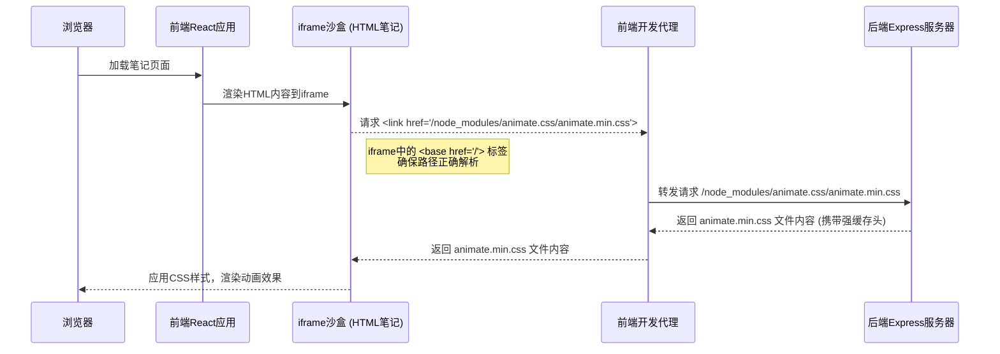

# HTML笔记如何使用后端托管依赖

本文档旨在说明如何在HTML笔记中引用由项目后端统一托管的前端依赖（如CSS框架、JavaScript库等），以实现内容的动态化和富交互，同时确保系统的安全性和性能。

## 一、实现机制概述

为了方便用户在笔记中利用丰富的第三方库，同时避免从公共CDN加载资源可能带来的不稳定性和安全风险，项目采用后端统一托管常用前端依赖的机制。

其工作流程如下：

1.  **后端托管**: 项目后端在 `/backend/vendor/node_modules/` 目录下预置了一系列常用的前端库。并通过一个特殊的路由 `/node_modules/*` 将这个目录暴露为静态资源服务。
2.  **高效缓存**: 后端对这些依赖文件设置了长达一年的强缓存策略 (`Cache-Control: immutable`)。这意味着您的浏览器在第一次加载某个库之后，后续会直接从本地缓存读取，极大地提升了笔记的加载速度。
3.  **前端沙盒渲染**: 您的HTML内容会被渲染在一个安全的 `<iframe>` 沙盒中，与主应用完全隔离。
4.  **路径自动解析**: 为了让您能方便地引用这些托管的依赖，`HtmlSandboxRenderer` 组件会自动在您的HTML `head` 中注入一个 `<base href="/">` 标签。这个标签会告知浏览器，所有以 `/` 开头的路径（例如 `/node_modules/...`）都应该从应用的根域名开始解析，从而正确地请求到后端托管的资源。

### 请求流程图



## 二、HTML内容编写规范

在HTML笔记中引用后端托管的依赖非常简单，您只需要遵循一个核心原则：**像在正常的网站根目录一样书写路径**。

### 1. 引用CSS文件

使用 `<link>` 标签，将 `href` 属性指向您需要的库文件。路径必须以 `/node_modules/` 开头。

**示例：引用 Animate.css**

```html
<head>
    <!-- 引入 Animate.css 动画库 -->
    <link rel="stylesheet" href="/node_modules/animate.css/animate.min.css">
</head>
<body>
    <h1 class="animate__animated animate__bounce">这是一个会弹跳的标题</h1>
</body>
```

### 2. 引用JavaScript文件

使用 `<script>` 标签，将 `src` 属性指向您需要的库文件。路径同样以 `/node_modules/` 开头。

**示例：引用 Chart.js**

```html
<body>
    <canvas id="myChart" width="400" height="200"></canvas>

    <!-- 引入 Chart.js 库 -->
    <script src="/node_modules/chart.js/dist/chart.umd.js"></script>
    <script>
        const ctx = document.getElementById('myChart').getContext('2d');
        new Chart(ctx, {
            type: 'bar',
            data: {
                labels: ['红色', '蓝色', '黄色', '绿色', '紫色', '橙色'],
                datasets: [{
                    label: '投票数量',
                    data: [12, 19, 3, 5, 2, 3],
                    backgroundColor: 'rgba(75, 192, 192, 0.2)',
                    borderColor: 'rgba(75, 192, 192, 1)',
                    borderWidth: 1
                }]
            }
        });
    </script>
</body>
```

### 3. 使用ESM模块导入

对于支持ESM（ECMAScript Modules）的现代库，您也可以使用 `type="module"` 的脚本进行导入。渲染器会自动处理裸模块导入（如 `import 'three'`）。

**示例：引用 three.js**

```html
<body>
    <script type="module">
        // 直接使用裸模块名导入，系统会自动映射到 /node_modules/three/build/three.module.js
        import * as THREE from 'three';

        const scene = new THREE.Scene();
        console.log('Three.js 版本:', THREE.REVISION);
    </script>
</body>
```

## 三、完整示例

一个更详细、更具交互性的 `Animate.css` 使用示例已为您准备好。您可以参考该文档来构建更复杂的动态笔记。

**➡️ [查看：调用后端托管Animate.css依赖的html例子.md](./调用后端托管Animate.css依赖的html例子.md)**

## 四、常见问题 (FAQ)

**Q1: 我如何知道后端托管了哪些库和版本？**
**A1:** 目前，您需要联系项目维护者来确认 `backend/vendor/node_modules/` 下可用的库。未来可能会提供一个可查询的依赖列表。

**Q2: 为什么我写的相对路径 `./node_modules/...` 也能工作？**
**A2:** 这也是因为 `<base href="/">` 标签的存在。它将文档的基准URL设置为根目录，所以 `./` 同样会从根目录开始解析。但为了代码的清晰和可维护性，我们强烈建议您始终使用从 `/` 开始的“绝对”路径。

**Q3: 我引用的库没有加载成功，该如何排查？**
**A3:**
1.  **检查路径**：确认您的 `href` 或 `src` 路径是否正确，它必须以 `/node_modules/` 开头，并且后面的库路径（如 `animate.css/animate.min.css`）需要完全准确。
2.  **打开浏览器开发者工具**：在笔记页面，右键选择“检查”，打开开发者工具。
    *   **控制台(Console)面板**：查看是否有红色的404 (Not Found)错误，这通常意味着您的路径写错了。
    *   **网络(Network)面板**：刷新页面，找到您引用的CSS或JS文件请求，查看其状态码。如果是404，同样是路径问题。如果是其他错误，可以提供给项目维护者以协助排查。
3.  **确认库是否存在**：联系项目维护者，确认您想使用的库是否已在后端托管。

**Q4: 我可以引用外部CDN的资源吗？**
**A4:** 可以。沙盒环境不会阻止您引用外部的CSS和JS文件。但我们更推荐使用内部托管的依赖，因为它们加载速度更快、更稳定，且不受外部网络波动的影响。

---
*文档创建于: {{CURRENT_DATE}}*