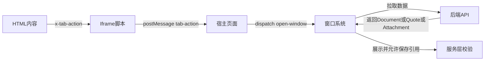

# 个人数据中心·设计哲学与系统落地说明

本文面向系统使用者与维护者，系统化阐述本项目的知识组织设计哲学，以及这些理念在数据模型、服务接口、前端交互与内容渲染中的具体落地方式。阅读本说明，可理解为何选择“原子化笔记 + 引用体 + 标签 + 数据库优先 + MD/HTML 混合内容 + 窗口化引用”的整体方案，以及如何在日常实践中贯彻，以降低心智负担、放大表达与连接的上限。

关联源码入口：
- 后端数据模型与接口： [backend/models/Document.js](backend/models/Document.js) · [backend/models/Quote.js](backend/models/Quote.js) · [backend/models/Attachment.js](backend/models/Attachment.js) · [backend/models/CustomPage.js](backend/models/CustomPage.js) · [backend/services/documentService.js](backend/services/documentService.js) · [backend/routes/documents.js](backend/routes/documents.js)
- 前端内容渲染与窗口系统： [frontend/src/components/MarkdownSandboxRenderer.jsx](frontend/src/components/MarkdownSandboxRenderer.jsx) · [frontend/src/components/HtmlSandboxRenderer.jsx](frontend/src/components/HtmlSandboxRenderer.jsx) · [frontend/src/components/DocumentWindow.jsx](frontend/src/components/DocumentWindow.jsx) · [frontend/src/components/QuoteWindow.jsx](frontend/src/components/QuoteWindow.jsx) · [frontend/src/components/AttachmentWindow.jsx](frontend/src/components/AttachmentWindow.jsx)
- 标签筛选与全局交互： [frontend/src/components/TagMultiSelect.js](frontend/src/components/TagMultiSelect.js) · [frontend/src/pages/CustomPage.jsx](frontend/src/pages/CustomPage.jsx) · [frontend/src/pages/Notes.js](frontend/src/pages/Notes.js)

1. 核心设计哲学

- 原子化笔记：每条笔记是最小知识单元，彼此的引用与组织就像原子之间的键合，构成更高阶的知识结构。对应数据实体为 Document。
- 连接优先：笔记之间可相互引用；此外引入“引用体”来以某个角度聚合若干笔记与素材，实现多维度的自由组织。
- 数据库优于手工归档：不依赖文件夹层级管理，改以数据库与索引来供需两端解耦，减少人为分类的开销与错位。
- 标签多视角：标签为轻量的多属性标注，支持并存的视角与语义，驱动检索与筛选。
- 内容多形态：同时支持 Markdown 与 HTML。Markdown关注易写易读；HTML承担更强表现力与交互，适配 AI 时代由模型生成丰富交互内容的趋势。
- 窗口化引用：在笔记内容中渲染“打开窗口”的动作，直达目标笔记或引用体，现场联动，增强关联说明上限。
- 附件即一等公民：图片、视频、文档、脚本等外部资料通过安全签名与引用被纳入知识网络，增强语义上下文。

2. 概念到数据模型的映射

2.1 Document：原子化笔记
- 字段要点：标题、Markdown 内容 content、HTML 内容 htmlContent、tags、source、referencedDocumentIds、referencedAttachmentIds 等，见 [backend/models/Document.js](backend/models/Document.js)。
- 内建索引：如 [documentSchema.index()](backend/models/Document.js:90) 强化全文与标签检索、时间排序与引用追踪。
- 自引用图谱：通过 referencedDocumentIds 建立原生“笔记到笔记”的连接；反向引用通过虚拟字段 [documentSchema.virtual()](backend/models/Document.js:113) 暴露 referencingQuotes，用于发现哪些引用体指向本笔记。
- 搜索能力：提供 [documentSchema.statics.searchDocuments()](backend/models/Document.js:152)，服务层组合分页与排序后经 API 暴露，见 [backend/routes/documents.js](backend/routes/documents.js) 与 [DocumentService.getDocumentById()](backend/services/documentService.js:80)。
- 约束校验：服务层提供 [DocumentService.validateReferencedDocuments()](backend/services/documentService.js:223) 与 [DocumentService.validateReferencedAttachments()](backend/services/documentService.js:268)，避免自引用、重复与无效 ObjectId，保证引用图一致性。

2.2 Quote：引用体（聚合视角）
- 定义：用于从某个角度聚合若干 Document、Quote、Attachment 并进行描述，贴近“类似文件夹但更自由”的组织诉求，见 [backend/models/Quote.js](backend/models/Quote.js)。
- 连接能力：包含 referencedDocumentIds、referencedQuoteIds、referencedAttachmentIds，可构造层层相引的柔性分类网络。
- 索引与摘要：全文检索与标签索引，见 [quoteSchema.index()](backend/models/Quote.js:90)；内容摘要见 [quoteSchema.virtual()](backend/models/Quote.js:103)。
- 检索： [quoteSchema.statics.searchQuotes()](backend/models/Quote.js:153) 支持关键词、分页与排序。

2.3 CustomPage：特定呈现面板
- 角色：用于混合排序与编排展示 Document、Quote、Attachment 的“自定义页面”，见 [backend/models/CustomPage.js](backend/models/CustomPage.js)。
- 统一内容项：contentItems 承载 { kind, refId } 的序列，支持校验 [customPageSchema.statics.validateContentItems()](backend/models/CustomPage.js:317)。
- 默认与同步：生成默认项 [customPageSchema.statics.generateDefaultContentItems()](backend/models/CustomPage.js:382)；与引用数组同步策略 [customPageSchema.statics.syncContentItemsWithReferences()](backend/models/CustomPage.js:435) 保持增量插入的可预期性。

2.4 Attachment：一等公民的外部素材
- 类别与状态：category 包含 image、video、document、script；status 区分 active 与 deleted，见 [backend/models/Attachment.js](backend/models/Attachment.js)。
- 访问与签名：暴露直达 URL 与 [attachmentSchema.virtual()](backend/models/Attachment.js:144) 的 signedUrl 概念；服务接口与中间件配合下载与权限，参见 [backend/routes/attachments.js](backend/routes/attachments.js) 与 [backend/middlewares/requireAttachmentAuth.js](backend/middlewares/requireAttachmentAuth.js)。

3. 两条组织路径：原生连接与引用体连接

- 原生连接（笔记 → 笔记）：Document.referencedDocumentIds 构成知识图主干；反向可通过 [DocumentService.getReferencingQuotes()](backend/services/documentService.js:310) 或在取单条笔记时附带 include 参数聚合相关引用体，API 详见 [backend/routes/documents.js](backend/routes/documents.js) 的 [router.get()](backend/routes/documents.js:73)。
- 引用体连接（视角聚合）：Quote 将若干笔记、引用体、附件拉入同一“叙事场”，并允许引用体之间相互引用，形成更灵活的分类体系。
- 自定义页面：CustomPage 借助 contentItems 混排不同实体，适合搭建主题页、看板或专题洞察视图，前端呈现见 [frontend/src/pages/CustomPage.jsx](frontend/src/pages/CustomPage.jsx)。

4. 标签系统：多视角多属性

- 轻量标注：Document 与 Quote 均支持 tags 字段，多标签并存即多视角叠加。
- 交互筛选：前端提供 [TagMultiSelect()](frontend/src/components/TagMultiSelect.js:34) 多选控件；后端提供标签检索 [DocumentService.searchByTags()](backend/services/documentService.js:428) 与对应路由 [router.get()](backend/routes/documents.js:41)。
- 全文搜索：文档层面的关键词检索由 [documentSchema.statics.searchDocuments()](backend/models/Document.js:152) 提供，服务层聚合分页并在 [backend/routes/documents.js](backend/routes/documents.js) 暴露 /search。

5. 内容形态与渲染管线

5.1 Markdown：简洁可读
- 渲染器： [MarkdownSandboxRenderer()](frontend/src/components/MarkdownSandboxRenderer.jsx:44) 以 iframe 沙箱隔离执行环境，并用 postMessage 自适应高度，保障页面整洁与安全。
- 风格扩展：通过基础样式、高亮与 KaTeX，覆盖学术与工程常见场景。

5.2 HTML：高表现与交互
- 渲染器： [HtmlSandboxRenderer()](frontend/src/components/HtmlSandboxRenderer.jsx:45) 提供更强大的 HTML 承载能力，支持 import map、静态资源错误监听与样式注入，仍在 iframe 沙箱内安全运行。
- 附件直连：在渲染前对内容进行预处理，将自定义协议 attach://ID 替换为带时效签名的实际可访问地址，依赖缓存模块 [frontend/src/services/attachmentUrlCache.js](frontend/src/services/attachmentUrlCache.js)。
- 窗口动作：支持内嵌自定义元素 x-tab-action（如 data-action=open-document 或 open-quote），渲染为按钮并通过 postMessage 通知父页面打开目标窗口，动作样式由 [frontend/src/utils/tabActionStyles.js](frontend/src/utils/tabActionStyles.js) 提供。
- 为什么偏爱 HTML：HTML 的表达与交互上限高，适合与 AI 生成内容结合，快速构造交互式演示、可视化或教学材料；同时通过沙箱与消息通道保证宿主页面安全与可控。

6. 窗口化引用与消息流

- 窗口组件： [DocumentWindow()](frontend/src/components/DocumentWindow.jsx:126) · [QuoteWindow()](frontend/src/components/QuoteWindow.jsx:126) · [AttachmentWindow()](frontend/src/components/AttachmentWindow.jsx:125) 提供一致的拖拽、缩放、最小化与置顶体验。
- 数据加载与持久化：各窗口内部承载 DetailContent 组件与保存回调，引用保存动作经 windowsSlice 分发，见 [frontend/src/store/windowsSlice.js](frontend/src/store/windowsSlice.js)。
- 消息链路：HTML 内容中按钮 → postMessage(tab-action) → 宿主页面监听 → 分发打开窗口动作 → 窗口组件加载数据并呈现。

流程图

7. 数据库优先与认知负担的降低

- 弱化手工归档：不再为“放在哪个文件夹”纠结，任何笔记都可通过标签、引用与搜索被找到。
- 连接即组织：原生引用与引用体两条路径互补，既保留知识的“本体连接”，又提供“视角叙事”的集合组织。
- 统一素材池：附件作为一等公民被引用与签名访问，跨笔记复用易于治理。
- 索引与统计：模型级索引保证检索速度；服务层统计能力可用于评估标签热度与知识增长，参见 [backend/services/documentService.js](backend/services/documentService.js)。

8. 一致性与安全

- 引用有效性：新增或更新引用时强制通过 [DocumentService.validateReferencedDocuments()](backend/services/documentService.js:223) 与 [DocumentService.validateReferencedAttachments()](backend/services/documentService.js:268)；附件仅允许 active 状态被引用。
- 反向清理：删除文档后，服务层会在引用体与其他文档中进行清理，见 [DocumentService.deleteDocument()](backend/services/documentService.js:378)。
- 附件安全：下载与直链访问需要相应令牌与中间件校验，参见 [backend/middlewares/requireAttachmentAuth.js](backend/middlewares/requireAttachmentAuth.js)。

9. 面向 AI 时代的内容生产

- 以 HTML 为载体：通过 [HtmlSandboxRenderer()](frontend/src/components/HtmlSandboxRenderer.jsx:45) 的 import map 与资源注入机制，可直接承载如 three 与可视化类库的交互 Demo，辅以 x-tab-action 打通知识网络。
- 生产方式：由 AI 生成的 HTML 片段经“attach://”与按钮动作增强后即可无缝入网；Markdown 仍适合日常记录与结构化文本。

10. 推荐实践

- 链接知识：优先使用“笔记→笔记”的 referencedDocumentIds 形成知识骨架；当需要从某个角度叙事或聚合时，引入 Quote 并允许多级引用。
- 善用标签：为笔记与引用体标注多维标签，用 [TagMultiSelect()](frontend/src/components/TagMultiSelect.js:34) 快速筛选。
- 富媒体：上传素材为 Attachment 并在 HTML 内容中经 attach://ID 引用；若需通用外链，仍建议走签名替换流程以保留权限与追踪。
- 即开即看：在 HTML 中插入 x-tab-action 元素生成“在窗口中打开”按钮，便于在说明文本中现场调取相关笔记或引用体进行串讲。

11. 术语速览

- 原子化笔记：最小知识单元，对应 Document。
- 引用体：以“角度”为核心的聚合单位，对应 Quote，可相互引用。
- 自定义页面：以展示为目的的混合面板，对应 CustomPage。
- 附件：各类外部素材，对应 Attachment。
- 窗口系统：前端内的浮动窗口集合，承载查看与编辑动作。

附录：相关 API 端点速查

- 文档检索与详情： [backend/routes/documents.js](backend/routes/documents.js)
  - 全文搜索： [router.get()](backend/routes/documents.js:29)
  - 标签搜索： [router.get()](backend/routes/documents.js:41)
  - 获取单条： [router.get()](backend/routes/documents.js:61)
  - 反向引用： [router.get()](backend/routes/documents.js:73)

版本与许可

- 系统版本与部署说明见 [README.md](README.md)。本项目采用 MIT 许可。